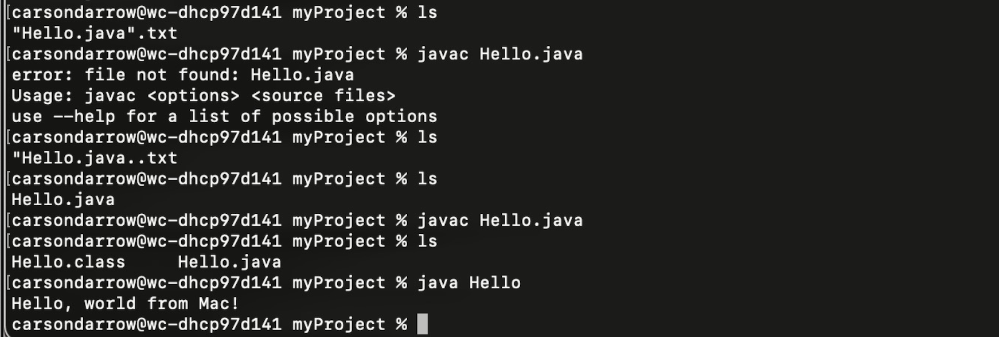
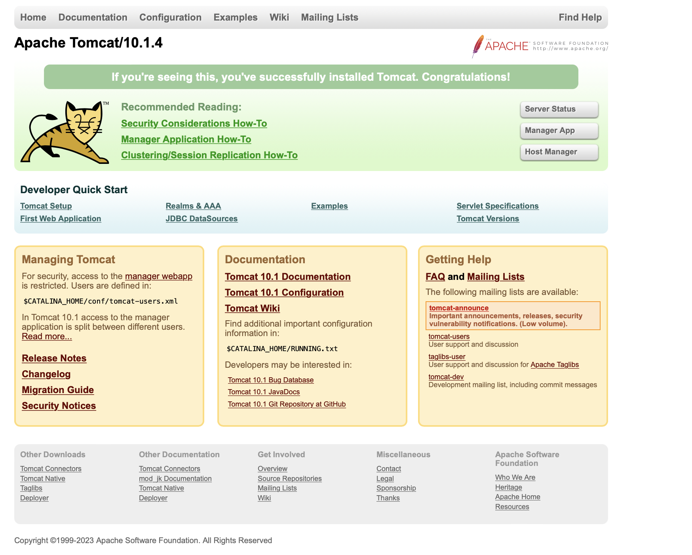
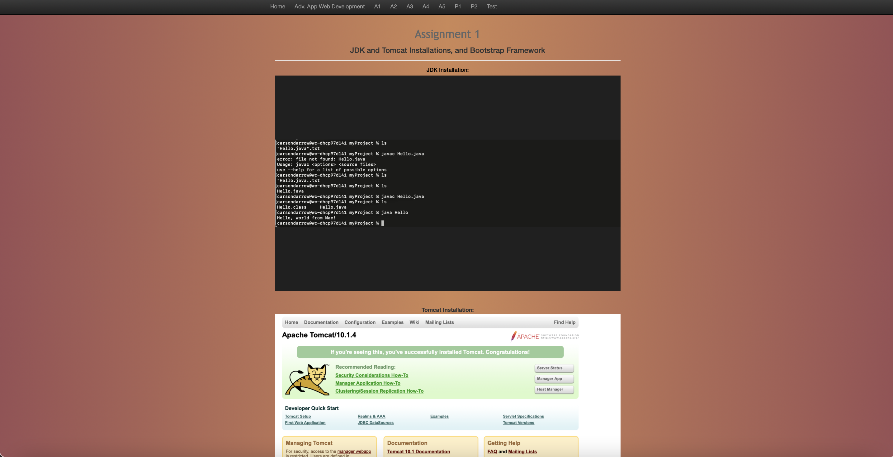

> **NOTE:** This README.md file should be placed at the **root of each of your repos directories.**
>
>Also, this file **must** use Markdown syntax, and provide project documentation as per below--otherwise, points **will** be deducted.
>

# LIS4368

## Carson Darrow

### Assignment 1 Requirements:

Three Parts:

1. Distributed Version Control with Git and Bitbucket
2. Development Installations
3. Chapter Questions (Chs 1-4)

#### README.md file should include the following items:

* Screenshot of Tomcat Installation 
* Screenshot of running java Hello
* Screenshot of running Local Host: 9999
* Screenshot of a1/index.jsp
* git commands with short descriptions
* Bitbucket repo links

> This is a blockquote.
> 
> This is the second paragraph in the blockquote.
>
> #### Git commands w/short Descriptions:

1. git init -  Create an empty Git repository or reset an existing one
2. git status -  Show the working tree status
3. git add -  Add file contents to the index
4. git commit - Record changes to the repository
5. git push - Update remote refs along with associated objects
6. git pull - Fetch from and integrate with another repository or local branch 
7. git version - Displays version information about Git

#### Assignment Screenshots:

*Screenshot of running java Hello*:

*Screenshot of Apache running http://localhost:9999/a1/index.jsp*:

*Screenshot of Tomcat A1/Index.jsp*:

#### Tutorial Links:

*Bitbucket Tutorial - Station Locations:*
[A1 Bitbucket Station Locations Tutorial Link](https://bitbucket.org/cbd19a/bitbucketstationlocations/ "Bitbucket Station Locations")

*Tutorial: Request to update a teammate's repository:*
[A1 My Team Quotes Tutorial Link](https://bitbucket.org/username/myteamquotes/ "My Team Quotes Tutorial")