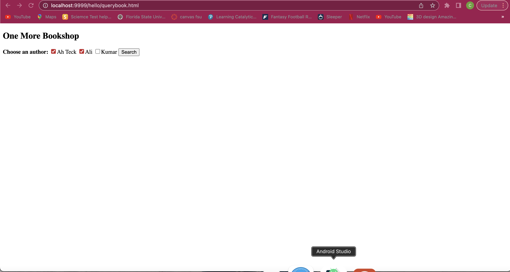

> **NOTE:** This README.md file should be placed at the **root of each of your repos directories.**
>
>Also, this file **must** use Markdown syntax, and provide project documentation as per below--otherwise, points **will** be deducted.
>

# LIS4368

## Carson Darrow

### Assignment 2 Requirements:

Assessment: the following links should properly display (see screenshots below):

* http://localhost:9999/hello(Displays directory! It should not! Needs index.html)
* http://localhost:9999/hello/HelloHome.html(Rename"HelloHome.html" to "index.html"so that users cannot see your files!)
* http://localhost:9999/hello/sayhello(invokes HelloServlet) Note: /sayhello maps to HelloServlet.class(changed web.xml file)
* http://localhost:9999/hello/querybook.html

#### README.md file should include the following items:

* Assessment links (as above), and
* Only one screenshot of the query results from the following link (see screenshot below): http://localhost:9999/hello/querybook.html

> This is a blockquote.
> 
> This is the second paragraph in the blockquote.
>

#### Assignment Screenshots:

| Running Hello | Running HelloServlet |
| -------------- | --------------|
|  |  |

| Running QueryBook | Running Query Results |
| -------------- | --------------|
|  |  |

### Skillset #1 - #3:

| Skillset #1 | Skillset #2 | Skillset #3 |
| -------------- | --------------| -------------- |
|  |  |  |

#### Tutorial Links:

*Bitbucket Tutorial - Station Locations:*
[A1 Bitbucket Station Locations Tutorial Link](https://bitbucket.org/cbd19a/bitbucketstationlocations/ "Bitbucket Station Locations")

*Tutorial: Request to update a teammate's repository:*
[A1 My Team Quotes Tutorial Link](https://bitbucket.org/username/myteamquotes/ "My Team Quotes Tutorial")