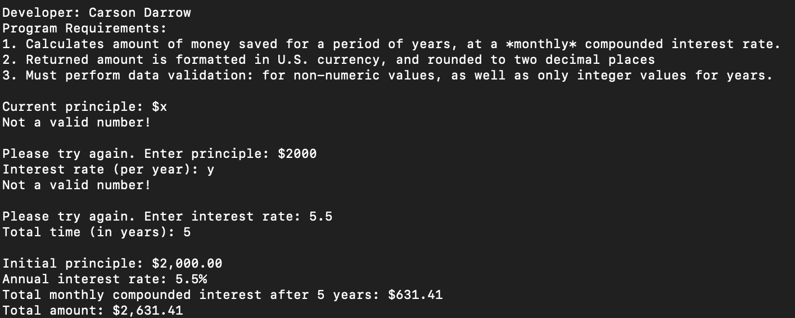

> **NOTE:** This README.md file should be placed at the **root of each of your repos directories.**
>
>Also, this file **must** use Markdown syntax, and provide project documentation as per below--otherwise, points **will** be deducted.
>

# LIS4368

## Carson Darrow

### Assignment 4 Requirements:

Three Parts:

1. Create Server-Side Validation
2. Modify and compile CustomerServlet.java
3. Modify and compile Customer.java
4. Read only access to Bitbucket Repo 

#### README.md file should include the following items:

* Course title, your name, assignment requirements, as per A1;
* Screenshot of Skillsets 10 - 12
* Screenshot of Failed Validation
* Screenshot of Passed Validation
	

> This is a blockquote.
> 
> This is the second paragraph in the blockquote.
>

#### Server-Side Validation:

#### Failed Validation:

#### Valid Data:

#### Passed Validation:

### Skillset #10 - #12:

| Skillset #10 |
| -------------- |
|  

| Skillset #11 | Skillset #12 |
| --------------| --------------|
|  | 

#### Tutorial Links:

*Bitbucket Tutorial - Station Locations:*
[A1 Bitbucket Station Locations Tutorial Link](https://bitbucket.org/cbd19a/bitbucketstationlocations/ "Bitbucket Station Locations")

*Tutorial: Request to update a teammate's repository:*
[A1 My Team Quotes Tutorial Link](https://bitbucket.org/username/myteamquotes/ "My Team Quotes Tutorial")