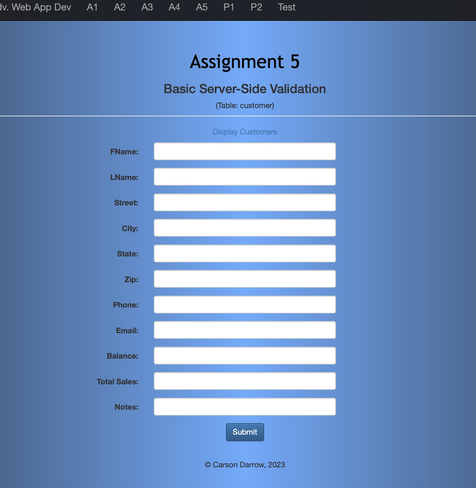
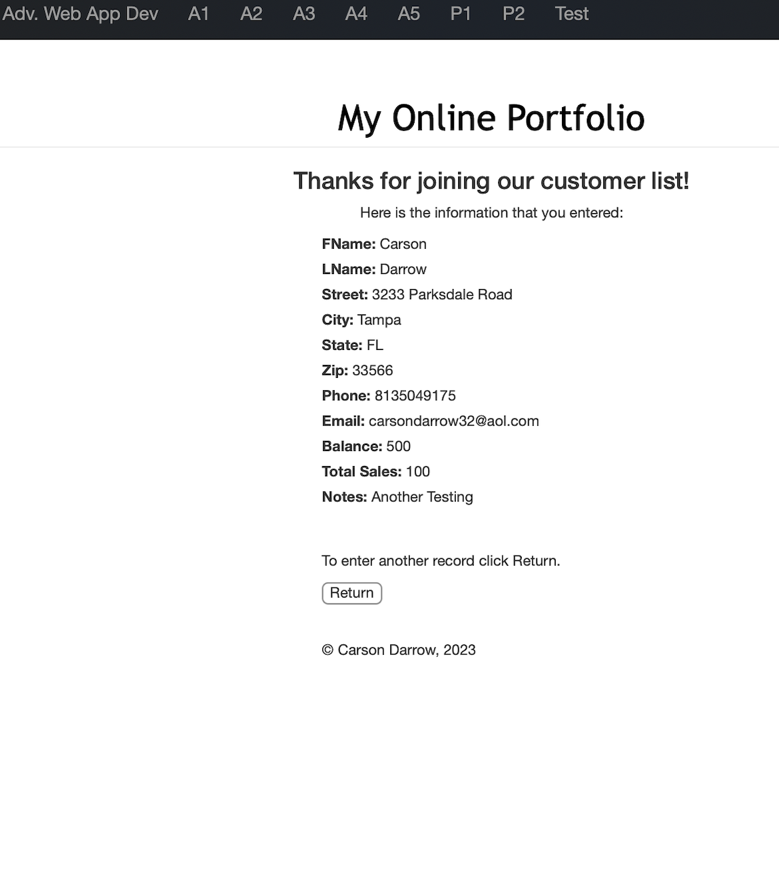
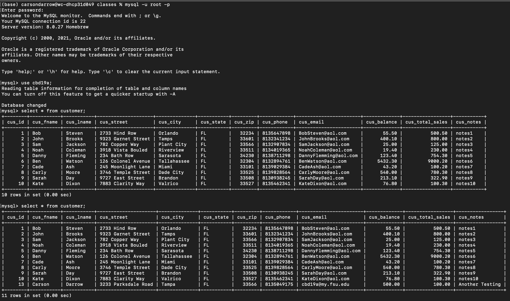
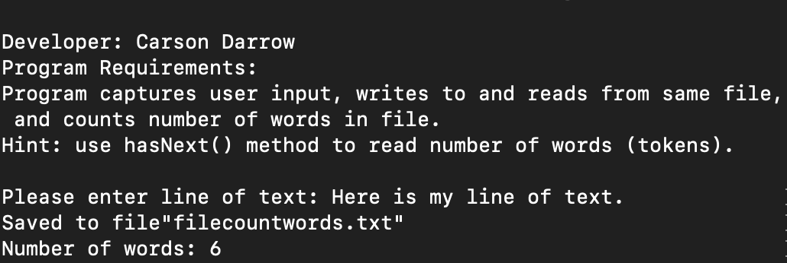
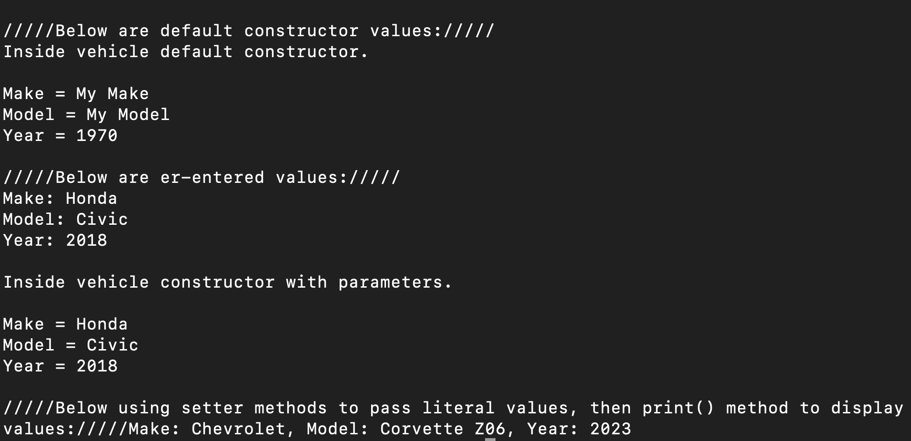
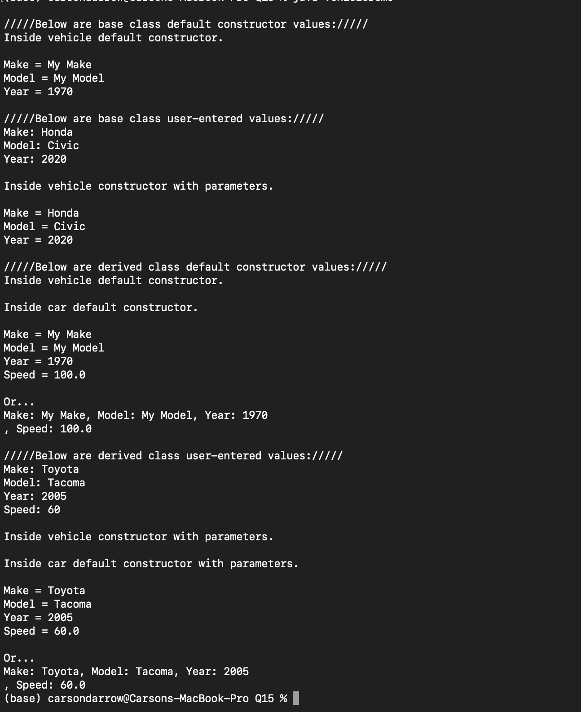

> **NOTE:** This README.md file should be placed at the **root of each of your repos directories.**
>
>Also, this file **must** use Markdown syntax, and provide project documentation as per below--otherwise, points **will** be deducted.
>

# LIS4368

## Carson Darrow

### Assignment 5 Requirements:

Three Parts:

1. Create Server-Side Validation
2. Modify and compile CustomerServlet.java
3. Add and compile Data Folder
4. Update SQL Database
5. Read only access to Bitbucket Repo 

#### README.md file should include the following items:

* Course title, your name, assignment requirements, as per A1;
* Screenshot of SQL Data Table Updated
* Screenshot of Skillsets 13 - 15

> This is a blockquote.
> 
> This is the second paragraph in the blockquote.
>
#### Assignment Screenshot:

| A5 Main | A5 Results |
| --------------| --------------|
|  |  |

#### SQL Table:

### Skillset #13 - #15:

| Skillset #13 | Skillset #14 |
 --------------| --------------|
|  |  |

| Skillset #15 |
| --------------|
| 

#### Tutorial Links:

*Bitbucket Tutorial - Station Locations:*
[A1 Bitbucket Station Locations Tutorial Link](https://bitbucket.org/cbd19a/bitbucketstationlocations/ "Bitbucket Station Locations")

*Tutorial: Request to update a teammate's repository:*
[A1 My Team Quotes Tutorial Link](https://bitbucket.org/username/myteamquotes/ "My Team Quotes Tutorial")