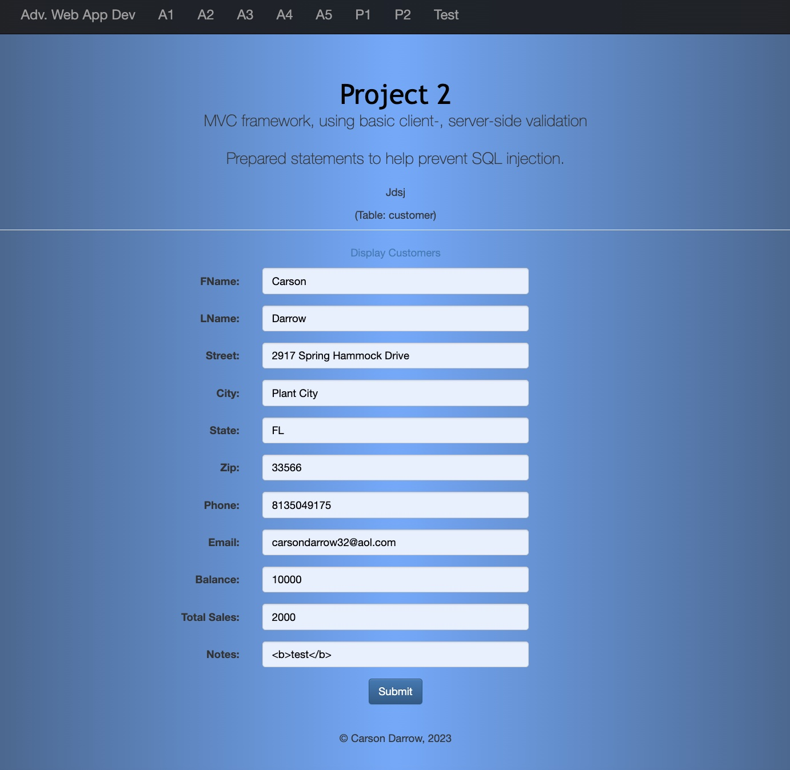
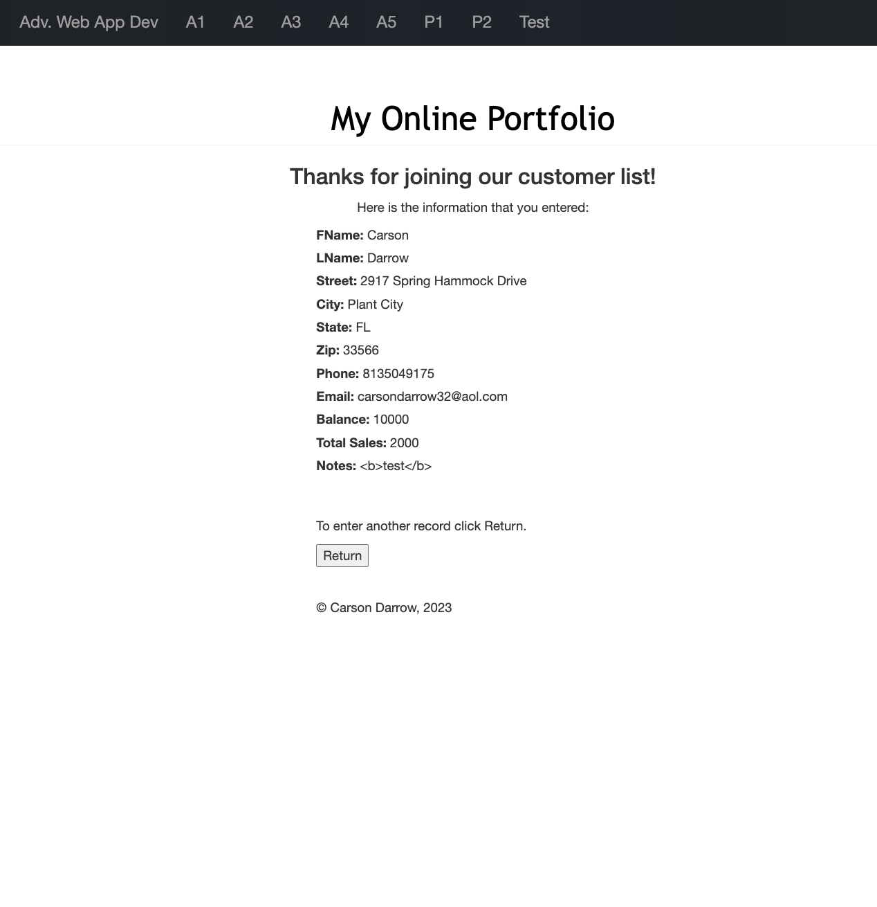
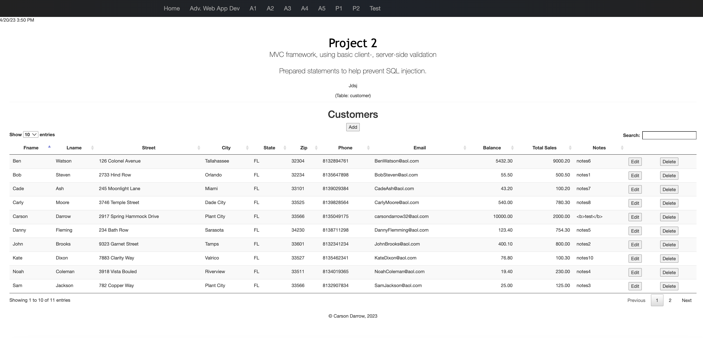
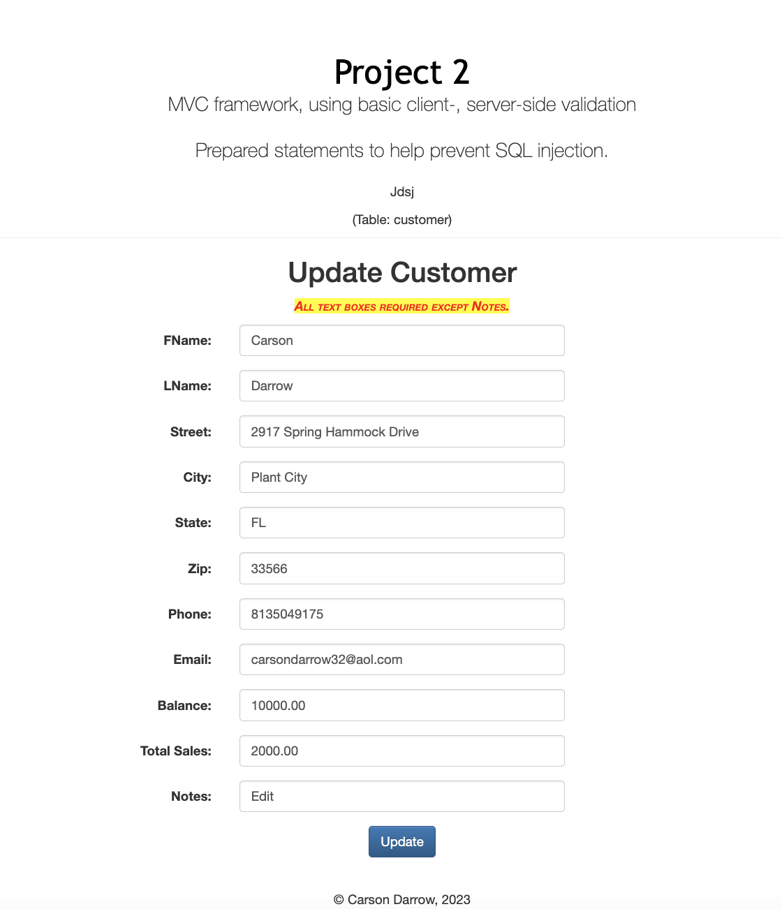
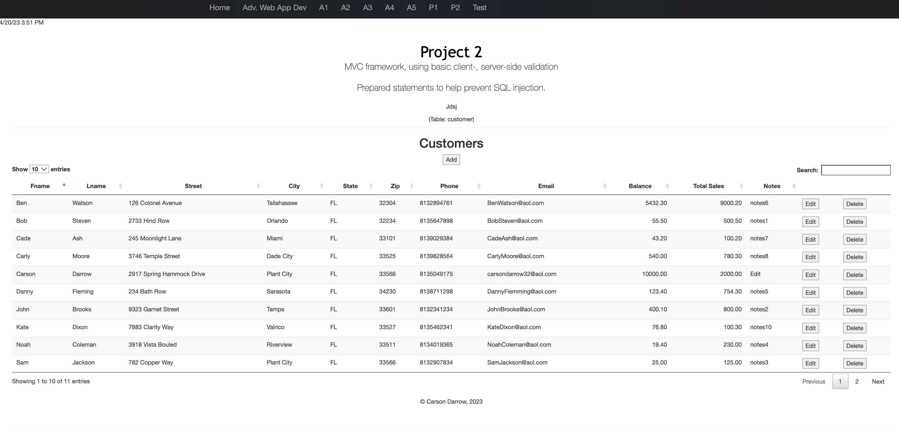
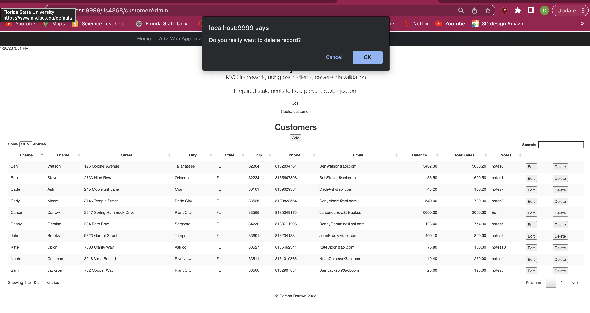
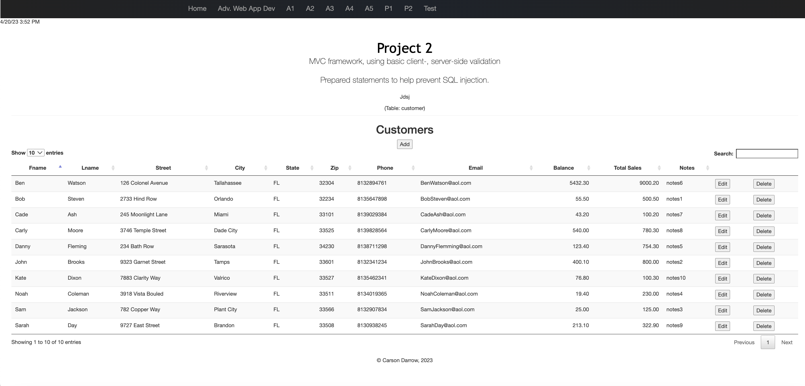
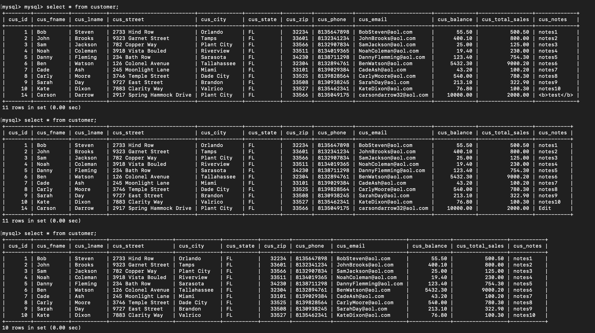

> **NOTE:** This README.md file should be placed at the **root of each of your repos directories.**
>
>Also, this file **must** use Markdown syntax, and provide project documentation as per below--otherwise, points **will** be deducted.
>

# LIS4368

## Carson Darrow

### Project 2 Requirements:

Three Parts:

1. Provide Bitbucketread-only access to lis4368repo, includelinks to the other assignment repos you created in README.md, using Markdownsyntax(README.mdmust also include screenshots as per above and below.)
2. Blackboard Links:lis4368Bitbucketrepo

#### README.md file should include the following items:

* Course title, your name, assignment requirements, as per A1;
* Screenshot of valid user form entry
* Screenshot of Passed Validation
* Screenshot of Displayed Data
* Screenshot of Modify Form
* Screenshot of Modified Data
* Screenshot of Delete Warning
* Screenshot of Associated Database Changes

> This is a blockquote.
> 
> This is the second paragraph in the blockquote.
>

#### Assignment Screenshots:

### Valid User Entry:

#### Passed Validation:

#### Displayed Data:

#### Modify Entry:

#### Data Table Modified

### Delete Entry:

#### Deletion on Data Table:

#### Databases Changed:

#### Tutorial Links:

*Bitbucket Tutorial - Station Locations:*
[A1 Bitbucket Station Locations Tutorial Link](https://bitbucket.org/cbd19a/bitbucketstationlocations/ "Bitbucket Station Locations")

*Tutorial: Request to update a teammate's repository:*
[A1 My Team Quotes Tutorial Link](https://bitbucket.org/username/myteamquotes/ "My Team Quotes Tutorial")